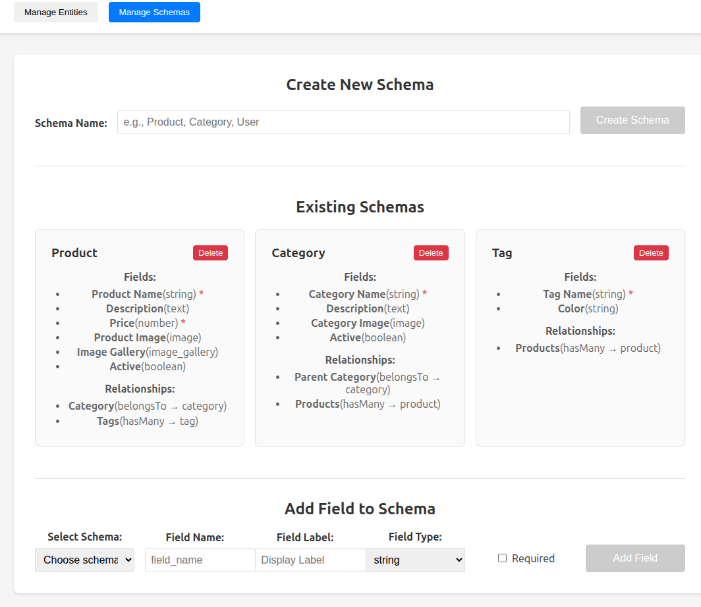

# Shop - Full Stack Generic CRUD System

## Generic Schema Creation


A complete full-stack application with React frontend and Rails API backend for managing any type of entity with relationships and image support.

## Project Structure

```
/home/cillianomurchu/projects/store/
├── frontend/          # React + Redux frontend
│   ├── src/
│   │   ├── components/      # Admin interface components
│   │   ├── store/          # Redux store and slices
│   │   └── services/       # API and image services
│   ├── public/
│   └── package.json
├── backend/           # Rails API backend
│   ├── app/
│   │   ├── models/         # Entity, Schema, EntityRelationship
│   │   └── controllers/    # API controllers
│   ├── db/
│   │   ├── migrate/        # Database migrations
│   │   └── seeds.rb        # Sample data
│   ├── config/
│   └── Gemfile
└── README.md         # This file
```

## Quick Start

### Backend (Rails API)

```bash
cd backend

# Install gems
bundle install

# Setup database
rails db:create db:migrate db:seed

# Start server (port 3001)
bundle exec rails server -p 3001
```

### Frontend (React)

```bash
cd frontend

# Install dependencies
npm install

# Start development server (port 3000)
npm start
```

## API Endpoints

### Schemas

- `GET /api/v1/schemas` - Get all schemas
- `POST /api/v1/schemas` - Create new schema
- `GET /api/v1/schemas/:id` - Get specific schema
- `PATCH /api/v1/schemas/:id` - Update schema
- `DELETE /api/v1/schemas/:id` - Delete schema

### Entities (Dynamic)

- `GET /api/v1/:entity_type` - List entities of type
- `POST /api/v1/:entity_type` - Create new entity
- `GET /api/v1/:entity_type/:id` - Get specific entity
- `PATCH /api/v1/:entity_type/:id` - Update entity
- `DELETE /api/v1/:entity_type/:id` - Delete entity

### Relationships

- `GET /api/v1/:entity_type/:id/relationships` - Get entity relationships
- `POST /api/v1/:entity_type/:id/relationships` - Create relationship
- `DELETE /api/v1/:entity_type/:id/relationships/:type` - Remove relationship

### Example API Usage

```bash
# Get all products
curl http://localhost:3001/api/v1/product

# Get all schemas
curl http://localhost:3001/api/v1/schemas

# Create a new product
curl -X POST http://localhost:3001/api/v1/product \
  -H "Content-Type: application/json" \
  -d '{
    "product": {
      "name": "iPhone 15",
      "description": "Latest iPhone model",
      "price": 999.99,
      "active": true
    }
  }'
```


## Interesting images along the way

### A few changes


## Features

### Frontend Features

- **Generic Admin Interface**: Manage any entity type
- **Dynamic Forms**: Auto-generated based on schemas
- **Image Upload**: Drag-and-drop with preview
- **Relationship Management**: Visual interface for entity connections
- **Schema Editor**: Create/modify entity types on the fly
- **Responsive Design**: Works on desktop and mobile

### Backend Features

- **Generic CRUD API**: RESTful endpoints for any entity type
- **Dynamic Schema System**: Define entity types with fields and relationships
- **Relationship Engine**: Manage connections between entities
- **Image Storage Ready**: Prepared for file uploads (Active Storage)
- **Search & Pagination**: Built-in with Kaminari and Ransack
- **CORS Configured**: Ready for frontend integration

### Entity Types (Predefined)

1. **Products**: name, description, price, image, gallery, active
2. **Categories**: name, description, image, active
3. **Tags**: name, color

### Relationship Types

- **belongsTo**: One-to-one or many-to-one
- **hasMany**: One-to-many

## Database Schema

### Entities Table

- `id` (UUID, primary key)
- `entity_type` (string, indexed)
- `name` (string)
- `data` (JSON, stores dynamic attributes)
- `created_at`, `updated_at`

### Entity Relationships Table

- `id` (UUID, primary key)
- `from_entity_id` (UUID, foreign key)
- `to_entity_id` (UUID, foreign key)
- `relationship_type` (string)
- `created_at`, `updated_at`

### Schemas Table

- `id` (UUID, primary key)
- `name` (string, unique)
- `fields` (JSON array, field definitions)
- `relationships` (JSON array, relationship definitions)
- `created_at`, `updated_at`

## Development

### Adding New Entity Types

1. **Frontend**: Go to Schema Manager → Create new schema
2. **Backend**: Schema is automatically available via API

### Adding New Field Types

1. **Frontend**: Update `fieldTypes` in SchemaManager
2. **Frontend**: Add rendering logic in EntityForm
3. **Backend**: Add validation in Schema model

### Extending Relationships

1. **Backend**: Add new relationship types to Schema model
2. **Frontend**: Update relationship handling in EntityForm

## Architecture

### Frontend Architecture

- **Redux Store**: Centralized state management
- **Component-Based**: Reusable UI components
- **Service Layer**: API and image handling
- **Generic Design**: Works with any entity type

### Backend Architecture

- **Generic Models**: Entity system works with any data type
- **JSON Storage**: Flexible attribute storage
- **RESTful API**: Standard HTTP conventions
- **UUID Primary Keys**: Better for distributed systems

## Technology Stack

### Frontend

- React 19.2.0
- Redux Toolkit
- CSS3 (Custom styling)
- Modern ES6+ JavaScript

### Backend

- Ruby on Rails 7.1.5 (API mode)
- SQLite (development) / PostgreSQL (production ready)
- UUID primary keys
- JSON serialization

## Sample Data

The system comes pre-seeded with:

- **Electronics** category
- **Laptops** subcategory
- **Technology** and **Popular** tags
- **MacBook Pro 14"** product with relationships

## Future Enhancements

### Ready for Implementation

- **Image Upload Backend**: Active Storage integration documented
- **Authentication**: JWT tokens (gems already installed)
- **File Storage**: S3/cloud storage ready
- **Advanced Search**: Ransack gem installed
- **API Pagination**: Kaminari gem installed

### Easily Extensible

- **New Field Types**: Date, select, multi-select, etc.
- **Validation Rules**: Per-field validation
- **Permissions**: Role-based access control
- **Audit Trail**: Track entity changes
- **Import/Export**: CSV, JSON data exchange

## Deployment

### Production Setup

1. **Database**: Switch to PostgreSQL in `database.yml`
2. **Environment**: Set `RAILS_ENV=production`
3. **Assets**: Configure cloud storage for images
4. **CORS**: Update origins for production domain
5. **SSL**: Enable HTTPS for API

This system provides a complete foundation for any type of data management application with infinite scalability and customization possibilities.

## License

MIT License
